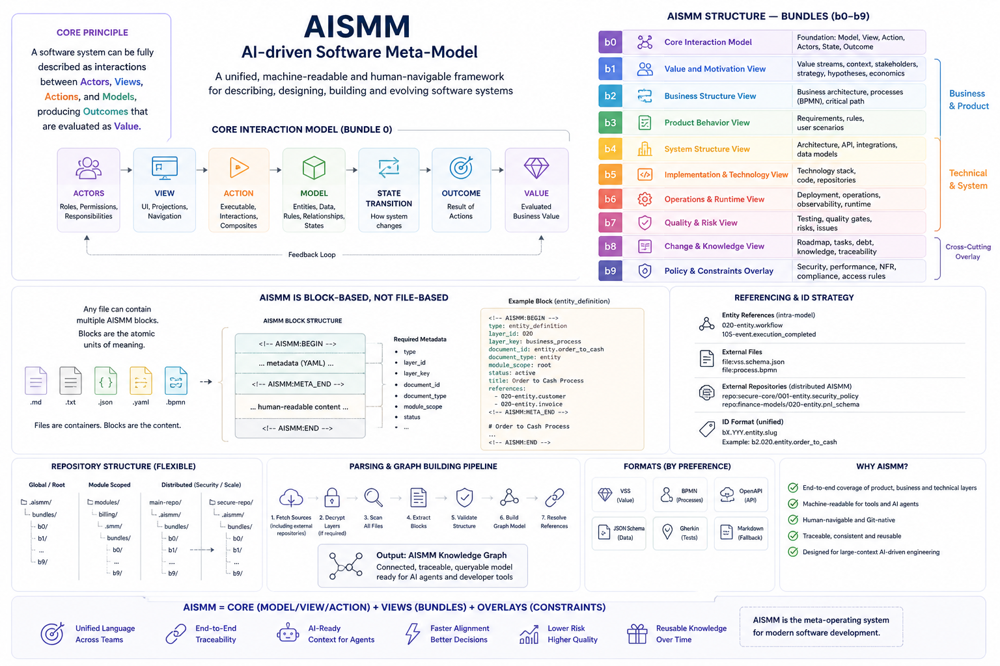

# AI-driven Software Meta-Model (AISMM)

## What is AISMM?

**AISMM (AI-driven Software Meta-Model)** is a structured, machine-readable and human-readable way to describe a software product as a complete system.

It is not just documentation.

AISMM is a **product knowledge model** that connects:

- why the product exists
- what business value it creates
- how the system is designed
- how behavior is specified
- how the code is implemented
- how the system runs in production
- how quality, risk and compliance are controlled
- how changes are planned and released
- how knowledge is indexed, traced and trusted

In simple terms:

```text
AISMM = full structured context of a software product
```

It is designed to be stored in Git, reviewed like code, used by humans, and processed by AI agents.

---

## AISMM at a glance

<p align="center">
  
</p>

<p align="center">
  <em>AISMM connects value, system design, execution and knowledge into a unified model for AI-driven software engineering.</em>
</p>

---

## Why AISMM is needed

Modern software products are not just code.

A real product includes:

- business goals
- value streams
- stakeholders
- requirements
- architecture
- data models
- APIs
- integrations
- processes
- UX scenarios
- runtime infrastructure
- monitoring
- incidents
- tests
- risks
- security controls
- release history
- decisions
- hidden context in tasks and discussions

Most companies keep this knowledge scattered across many systems:

```text
Jira + Git + Confluence + Figma + BPMN + Grafana + CI/CD + Slack + people's heads
```

This creates several problems:

- AI agents cannot understand the full product context.
- New developers need too much time to understand the system.
- Architecture decisions lose their original reasoning.
- Requirements drift away from implementation.
- Tests are not clearly linked to behavior.
- Incidents are not clearly linked to releases and changes.
- Product value is disconnected from technical work.
- Knowledge becomes too large, noisy and hard to retrieve.

AISMM solves this by turning scattered product knowledge into a **connected semantic model**.

---

## Core idea

AISMM treats a software system as:

```text
Value + Structure + Behavior + Execution + Change + Knowledge
```

Or more explicitly:

```text
Software System =
  Business Value
  + Product Behavior
  + System Design
  + Implementation
  + Runtime Reality
  + Quality / Risk / Compliance
  + SDLC History
  + Traceable Knowledge
```

This allows both humans and AI agents to reason about the product as a whole.

---

## What AISMM gives you

### 1. Full Context Development

AISMM supports **Full Context Development (FCD)**: development where every change is made with full awareness of product context.

Instead of giving an AI agent or developer only a task description, AISMM provides:

- related requirements
- affected components
- relevant APIs
- data entities
- domain rules
- previous decisions
- related risks
- tests and acceptance criteria
- release and runtime context

This improves the quality of both human and AI-driven development.

---

### 2. Traceability from value to code

AISMM makes it possible to trace chains like:

```text
business hypothesis
  → requirement
  → domain rule
  → component
  → API
  → code module
  → test case
  → release
  → runtime metric
  → incident
```

This supports:

- impact analysis
- root cause analysis
- auditability
- change planning
- risk control
- AI reasoning

---

### 3. AI-ready product context

AISMM is designed for AI agents and RAG systems.

It provides:

- stable IDs
- structured layers
- traceability graph
- source provenance
- confidence scores
- retrieval units
- context packages
- coverage and consistency checks

This helps AI agents answer not only:

```text
What should I change?
```

but also:

```text
Why does this exist?
What will be affected?
Which context is missing?
How confident are we?
```

---

### 4. Product memory

AISMM preserves not only the current state of the product, but also the reasoning behind it.

This is especially important for long-lived products.

AISMM keeps:

- change history
- decision logs
- rejected alternatives
- implementation reasoning
- release history
- incident links
- knowledge summaries

This creates a product memory that survives team changes and supports AI reasoning.

---

### 5. Value-based knowledge retention

AISMM does not store all history equally.

Historical data is compressed based on:

- business value
- complexity
- system impact
- knowledge density

```text
Retention Priority = f(Value, Complexity, Impact, Knowledge Density)
```

High-value and complex changes retain more context. Low-value noise is compressed aggressively.

---

## How AISMM is structured

AISMM is organized into bundles.

Each bundle contains:

- layer specifications
- machine-readable schema
- preferred representations
- cross-layer links

---

## Bundles

### b0 — Product Core

Defines the product foundation:

- product definition and context
- value streams
- stakeholders and motivation
- business architecture
- critical path
- economics model

Purpose:

```text
Why does the product exist and what value does it create?
```

---

### b1 — Business Dynamics

Defines how the business evolves:

- business hypotheses
- strategy and product management
- business processes

Purpose:

```text
How does the product move through business reality?
```

---

### b2 — System Design

Defines how the system is structured:

- applications and system architecture
- data and information architecture
- API and interfaces
- integrations
- external systems and ecosystem surface *(v2)*
- event catalog and event mesh *(v2)*
- bounded contexts and domain architecture *(v2)*

Purpose:

```text
How is the product designed as a system?
```

---

### b3 — Implementation

Defines how the system becomes executable software:

- technology architecture
- code and implementation
- build, deployment and runtime artifacts
- dependency inventory, SBOM and reproducibility *(v2)*
- configuration, feature flags and environment variants *(v2)*

Purpose:

```text
How is the system implemented and delivered?
```

---

### b4 — Product Behavior

Defines what the system must do:

- requirements
- domain model and business rules
- access rights
- NFR and quality attributes
- state machines and lifecycles *(v2)*
- behavioral contracts and invariants *(v2)*
- error taxonomy and failure behavior *(v2)*

Purpose:

```text
What behavior must the product provide?
```

---

### b5 — User Interaction

Defines how users interact with the product:

- user scenarios and UX logic
- interface structure and navigation
- screens, forms and UI states
- design system and UI components *(v2)*
- accessibility, localization and notifications *(v2)*

Purpose:

```text
How does the user experience system behavior?
```

---

### b6 — Runtime Operations

Defines how the system lives in production:

- runtime environment and topology
- observability and monitoring
- incident management and response
- SLA, SLO and operational governance
- capacity, scaling and performance engineering *(v2)*
- disaster recovery, backup and continuity *(v2)*
- operational readiness and drills *(v2)*

Purpose:

```text
How does the system operate in reality?
```

---

### b7 — Quality, Risk & Compliance

Defines assurance and control:

- quality assurance and testing
- risk management
- security and privacy
- compliance and audit
- threat modeling and attack surface *(v2)*
- vulnerability management and disclosure *(v2)*
- privacy rights and DPIA *(v2)*

Purpose:

```text
How do we prove the system is correct, safe and compliant?
```

---

### b8 — Change Execution

Defines SDLC and product evolution:

- work items and change requests
- planning and delivery flow
- testing and acceptance execution
- release, version and rollout management
- change history and decision log
- knowledge retention and history compaction
- feedback loops and learning cycles *(v2)*
- CI/CD pipeline and automation *(v2)*
- migration, backfill and long-running refactors *(v2)*

Purpose:

```text
How does the product change over time?
```

---

### b9 — Knowledge Traceability

Defines how knowledge is connected and trusted:

- knowledge index and navigation
- traceability graph
- source provenance and confidence
- context coverage and consistency
- context retrieval and RAG
- ontology, vocabulary and relationship taxonomy *(v2)*

Purpose:

```text
How does the system know what it knows?
```

---

### b10 — Data and AI Lifecycle *(v2)*

Defines the operational lifecycle of data assets and AI/ML artifacts:

- data products and contracts
- data lineage and schema evolution
- feature and embedding lifecycle
- model registry and versioning
- training, evaluation and experimentation
- drift, monitoring and retraining
- labeling, annotation and ground truth
- data quality and observability

Purpose:

```text
How are data and AI models created, governed, and maintained?
```

---

### b11 — Organization, Ownership and Governance *(v2)*

Defines the human organizational structure behind the product:

- team topology and RACI
- ownership graph
- decision rights and governance
- skills and capability matrix
- vendors and external responsibilities
- capacity and allocation

Purpose:

```text
Who owns, decides, and has capacity to evolve the product?
```

---

### b12 — FinOps and Technical Economics *(v2)*

Defines the technical cost dimension of the product:

- cost allocation and showback
- capacity and commitment management
- token and inference economics
- cost of quality and incident
- unit economics by service, tenant and request
- carbon and sustainability accounting

Purpose:

```text
What does the product cost to run, and where does that cost go?
```

---

## Block-based model

AISMM is not file-based.

AISMM is **block-based**.

Any Markdown or structured file can contain AISMM blocks:

```text
<!-- AISMM:BEGIN -->
type: layer_specification
layer_id: 401
layer_key: requirements
document_id: spec.requirements
document_type: layer_specification
module_scope: root
status: stable
spec_version: 1.0.0
<!-- AISMM:META_END -->

# Human-readable content

...

<!-- AISMM:END -->
```

This means AISMM can be embedded into normal project documentation while still remaining machine-readable.

---

## Repository-native by design

AISMM is intended to live in Git.

This gives:

- versioning
- review process
- branching
- pull requests
- CI validation
- traceability between model and code

A typical repository may look like:

```text
repo/
  README.md
  aismm-structure.md
  aismm-security.md
  aismm-unified-id-strategy.md

  b0-product-core/
    README.md
    b0.schema.json
    001-product-definition-context.md
    ...

  b1-business-dynamics/
    README.md
    b1.schema.json
    ...

  b9-knowledge-traceability/
    README.md
    b9.schema.json
    ...
```

---

## Machine-readable schemas

Each bundle has a JSON Schema:

```text
b0.schema.json
b1.schema.json
...
b9.schema.json
```

These schemas define the expected structure of the corresponding bundle.

They can be used for:

- validation
- agent input/output contracts
- CI checks
- repository health checks
- automated documentation generation

---

## Preferred representations

AISMM defines semantic layers first. Specific formats are only preferred representations.

Examples:

| Domain | Preferred Representation |
|---|---|
| Value streams | VSS / Æilus value stream model |
| Processes | BPMN |
| REST API | OpenAPI |
| Events | AsyncAPI |
| Data model | JSON Schema / CSDL / ER |
| UI | Figma / IFML / UI registry |
| Tests | Gherkin / test management exports |
| Runtime metrics | Prometheus / Grafana / OpenTelemetry |
| Traceability | Graph model / JSON graph / Neo4j |

Important principle:

```text
Format is not the model.
Format is only a representation of the model.
```

---

## AISMM and AI agents

AISMM itself does not define agent contracts.

Agent capabilities, result contracts and execution interfaces should live in separate repositories.

AISMM provides the structured product context that agents consume and update.

```text
AISMM = product/system knowledge
Agent contracts = how agents work with that knowledge
```

This separation keeps AISMM focused on product knowledge and allows agent contracts to evolve independently.

---

## AISMM and RAG

AISMM can be used as a high-quality source for RAG.

But AISMM is more than a vector database.

A proper AISMM RAG pipeline should preserve:

- entity IDs
- source references
- traceability links
- confidence
- coverage
- consistency warnings
- missing context

RAG should not flatten AISMM into anonymous chunks.

AISMM retrieval should produce context packages that remain connected to the semantic graph.

---

## Who benefits from AISMM?

### Product leaders

Understand how strategy, value, requirements and releases are connected.

### CTOs and architects

See system structure, dependencies, risks, runtime reality and evolution history.

### Developers

Get full context for tasks and understand why the system is built the way it is.

### QA engineers

Trace tests to requirements, rules, user scenarios and releases.

### DevOps / SRE

Connect runtime signals, incidents, releases and operational policies.

### Security and compliance teams

Trace controls, risks, evidence, audits and privacy requirements.

### AI agents

Retrieve structured context, reason over graph relationships and perform safer changes.

---

## AISMM v2 Additions

AISMM v2 evolves the model from a product knowledge store into a **governed, lifecycle-aware, AI-ready meta-model**. Key additions:

- **Three new bundles**: b10 (Data and AI Lifecycle), b11 (Organization, Ownership and Governance), b12 (FinOps and Technical Economics)
- **Strict Mode**: enforceable validation rules, `aismm.validation.json` CI artifact
- **Semantic Diff**: model-level PR review with `aismm.semantic_diff.json`
- **Temporal Validity**: time-aware entities with `valid_from`, `valid_to`, and release-bound validity
- **Physical Identity Binding**: logical-to-physical traceability linking IDs to code symbols, files, and digests
- **Feedback Loops**: explicit closed-loop learning from incidents, metrics, audits, and RAG evaluation
- **Conformance Levels**: L1–L5 staged implementation path
- **Context Security**: block authorship classes and prompt injection defense for AI agent consumption
- **AISMM Health Model**: self-observability with `aismm.health.json`
- **Relationship Taxonomy**: 23 canonical typed relationships in b9.906
- **Agent Contract References**: clean bridge to external agent contracts without embedding them

See [`CHANGELOG.md`](./CHANGELOG.md) for the full list of changes and migration guidance.

---

## Agent Contract Boundary

AISMM is consumed by AI agents as structured product context. However, **AISMM does not define agent contracts**.

Agent capabilities, result schemas, and execution interfaces live in separate repositories.

AISMM references agent contracts via lightweight reference entities and records the effects of agent operations on the product model.

```text
AISMM = product/system knowledge
Agent contracts = how agents work with that knowledge
```

See [`aismm-agent-contract-references.md`](./aismm-agent-contract-references.md).

---

## Consistency and Source of Truth

AISMM v2 defines explicit source-of-truth rules across all bundles:

- Each concept has exactly one owner bundle. Other bundles may project or reference it.
- b9 is a graph/index/projection layer — it does not own business or system facts.
- b11 owns organizational ownership; b9 projects ownership edges.
- b0 owns product economics; b12 owns technical cost details.

See [`aismm-consistency-rules.md`](./aismm-consistency-rules.md) for the full source-of-truth map, projection rules, conflict resolution, and lifecycle flows.

---

## Layer Inventory

Every layer in AISMM is tracked in a complete inventory:

- [`aismm-layer-inventory.md`](./aismm-layer-inventory.md) — all 82 layers across b0–b12 with README/schema status

**Layer ID format:**
- b0–b9: 3-digit IDs (e.g. `401`, `902`)
- b10+: 4-digit IDs (e.g. `1001`, `1104`, `1206`) — do not truncate

---

## Strict Mode, Semantic Diff and Health

AISMM v2 adds governance tooling:

- [`aismm-strict-mode.md`](./aismm-strict-mode.md) — Validation rules and CI enforcement
- [`aismm-semantic-diff.md`](./aismm-semantic-diff.md) — Model-level PR review
- [`aismm-health.md`](./aismm-health.md) — Repository health checks and `aismm.health.json`
- [`aismm-consistency-checks.md`](./aismm-consistency-checks.md) — Repeatable consistency validation guidance

---

## Temporal Validity and Physical Identity

- [`aismm-temporal-validity.md`](./aismm-temporal-validity.md) — `valid_from`, `valid_to`, release-bound validity, time-travel queries
- [`aismm-physical-identity-binding.md`](./aismm-physical-identity-binding.md) — Linking logical IDs to code symbols, files, artifacts, and digests

---

## Feedback Loops

- [`aismm-feedback-loops.md`](./aismm-feedback-loops.md) — Six canonical closed-loop learning paths (incident, metric, audit, customer, test, RAG)

---

## Practical use cases

AISMM can be used for:

- AI-assisted development
- architecture documentation
- onboarding
- impact analysis
- change planning
- release preparation
- root cause analysis
- compliance evidence
- risk analysis
- test coverage analysis
- product knowledge preservation
- full-context development

---

## What AISMM is not

AISMM is not:

- a programming language
- a framework
- a replacement for Git, Jira, Figma or CI/CD
- a documentation-only method
- a vector database

AISMM is a **meta-model** that connects these systems into a coherent product knowledge structure.

---

## Versioning and Conformance

AISMM uses **semantic versioning** (`MAJOR.MINOR.PATCH`).

Current version: **AISMM 2.0.0**

Repositories may declare a **conformance level** to indicate how fully they implement the meta-model:

| Level | Name | Description |
|-------|------|-------------|
| L1 | Block Format | AISMM-compatible blocks with metadata headers |
| L2 | Typed Entities | Explicitly typed and identifiable entities |
| L3 | Traceability Graph | Cross-layer typed relationships |
| L4 | RAG-Ready Context | Blocks optimized for retrieval-augmented generation |
| L5 | Agent-Grade Governance | Full audit trail, agent scoping, and source provenance |

See [`aismm-versioning-and-conformance.md`](./aismm-versioning-and-conformance.md) for the full versioning model, layer lifecycle statuses, migration policy, and extension namespace rules.

---

## Summary

AISMM defines software as a connected system of:

```text
Value
+ Business Dynamics
+ System Design
+ Implementation
+ Behavior
+ User Interaction
+ Runtime
+ Quality / Risk / Compliance
+ Change Execution
+ Knowledge Traceability
```

In one sentence:

```text
AISMM is a structured, Git-native, AI-ready product knowledge model for full-context software development.
```

Its goal is to make software systems understandable, traceable, evolvable and ready for AI-driven engineering.
