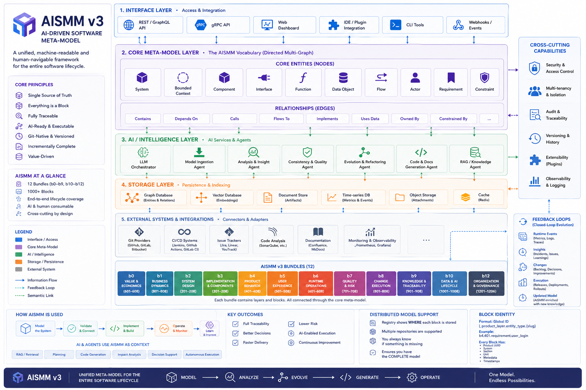

# AI-driven Software Meta-Model (AISMM)

<p align="center">
  <a href="./LICENSE"></a>
  
  
  <a href="./CONTRIBUTING.md"></a>
  <a href="./CODE_OF_CONDUCT.md"></a>
</p>

<p align="center">
  <em>A structured, Git-native, AI-ready product knowledge model for full-context software development.</em>
</p>

## Contents

- [What is AISMM?](#what-is-aismm)
- [Quick start](#quick-start)
- [Why AISMM is needed](#why-aismm-is-needed)
- [Core idea](#core-idea) · [What AISMM gives you](#what-aismm-gives-you)
- [How AISMM is structured](#how-aismm-is-structured) · [Bundles (b0–b12)](#bundles)
- [Canonical product model layout](#canonical-product-model-layout) · [Document model](#document-model)
- [Repository-native by design](#repository-native-by-design) · [Machine-readable schemas](#machine-readable-schemas)
- [AISMM and AI agents](#aismm-and-ai-agents) · [AISMM and RAG](#aismm-and-rag)
- [What's new in v3.1](#aismm-v31-additions) · [v3 additions](#aismm-v3-additions) · [v2 additions](#aismm-v2-additions)
- [How AISMM relates to other approaches](#how-aismm-relates-to-other-approaches)
- [What AISMM is not](#what-aismm-is-not) · [Versioning and conformance](#versioning-and-conformance)
- [FAQ](#faq)
- [Contributing & community](#contributing--community) · [License](#license)

## What is AISMM?

**AISMM (AI-driven Software Meta-Model)** is a structured, machine-readable and human-readable way to describe a software product as a complete system.

It is not just documentation.

AISMM is a **product knowledge model** that connects:

- why the product exists
- what business value it creates
- how the system is designed
- how behavior is specified
- how the code is implemented
- how the system runs in production
- how quality, risk and compliance are controlled
- how changes are planned and released
- how knowledge is indexed, traced and trusted

In simple terms:

```text
AISMM = full structured context of a software product
```

It is designed to be stored in Git, reviewed like code, used by humans, and processed by AI agents.

---

## AISMM at a glance

<p align="center">
  
</p>

<p align="center">
  <em>AISMM connects value, system design, execution and knowledge into a unified model for AI-driven software engineering.</em>
</p>

---

## Quick start

AISMM is a **specification**, not a package to install. "Getting started" means
putting a product's knowledge under the model. The fastest path:

1. **Vendor the meta-model into your product repo.** Add this canon as
   `00-meta/software-meta-model-main/` (and the template tree alongside it) so
   your repo carries the rules it conforms to. See
   [Canonical product model layout](#canonical-product-model-layout).

2. **Create the registry.** Copy
   [`examples/aismm.registry.example.json`](./examples/aismm.registry.example.json)
   to `aismm.registry.json` at your repo root and fill in your `product_id` and
   sources. Parsers and agents start from this file — see
   [`aismm-model-registry.md`](./aismm-model-registry.md).

3. **Stand up the bundle/layer folders** under `aismm/` (b0–b12). For any layer
   you'll need but haven't filled yet, drop an **explicit empty-layer block**
   instead of leaving it missing — copy
   [`examples/empty-layer.example.md`](./examples/empty-layer.example.md). See
   [Empty layers vs missing layers](#empty-layers-vs-missing-layers).

4. **Write your first real layer** — a good start is `b0.001` (product
   definition) or `b4.401` (requirements). Add the AISMM block header (see
   [Document model](#document-model)) and link it to related entities.

5. **Validate and declare a level.** Run the consistency and health checks
   ([`aismm-consistency-checks.md`](./aismm-consistency-checks.md),
   [`aismm-health.md`](./aismm-health.md)) and declare a
   [conformance level](#versioning-and-conformance) — start at L1.

> New to the concepts? Read [What is AISMM?](#what-is-aismm) and
> [Core idea](#core-idea) first, then come back here.

---

## Why AISMM is needed

Modern software products are not just code.

A real product includes:

- business goals
- value streams
- stakeholders
- requirements
- architecture
- data models
- APIs
- integrations
- processes
- UX scenarios
- runtime infrastructure
- monitoring
- incidents
- tests
- risks
- security controls
- release history
- decisions
- hidden context in tasks and discussions

Most companies keep this knowledge scattered across many systems:

```text
Jira + Git + Confluence + Figma + BPMN + Grafana + CI/CD + Slack + people's heads
```

This creates several problems:

- AI agents cannot understand the full product context.
- New developers need too much time to understand the system.
- Architecture decisions lose their original reasoning.
- Requirements drift away from implementation.
- Tests are not clearly linked to behavior.
- Incidents are not clearly linked to releases and changes.
- Product value is disconnected from technical work.
- Knowledge becomes too large, noisy and hard to retrieve.

AISMM solves this by turning scattered product knowledge into a **connected semantic model**.

---

## Core idea

AISMM treats a software system as:

```text
Value + Structure + Behavior + Execution + Change + Knowledge
```

Or more explicitly:

```text
Software System =
  Business Value
  + Product Behavior
  + System Design
  + Implementation
  + Runtime Reality
  + Quality / Risk / Compliance
  + SDLC History
  + Traceable Knowledge
```

This allows both humans and AI agents to reason about the product as a whole.

---

## What AISMM gives you

### 1. Full Context Development

AISMM supports **Full Context Development (FCD)**: development where every change is made with full awareness of product context.

Instead of giving an AI agent or developer only a task description, AISMM provides:

- related requirements
- affected components
- relevant APIs
- data entities
- domain rules
- previous decisions
- related risks
- tests and acceptance criteria
- release and runtime context

This improves the quality of both human and AI-driven development.

---

### 2. Traceability from value to code

AISMM makes it possible to trace chains like:

```text
business hypothesis
  → requirement
  → domain rule
  → component
  → API
  → code module
  → test case
  → release
  → runtime metric
  → incident
```

This supports:

- impact analysis
- root cause analysis
- auditability
- change planning
- risk control
- AI reasoning

---

### 3. AI-ready product context

AISMM is designed for AI agents and RAG systems.

It provides:

- stable IDs
- structured layers
- traceability graph
- source provenance
- confidence scores
- retrieval units
- context packages
- coverage and consistency checks

This helps AI agents answer not only:

```text
What should I change?
```

but also:

```text
Why does this exist?
What will be affected?
Which context is missing?
How confident are we?
```

---

### 4. Product memory

AISMM preserves not only the current state of the product, but also the reasoning behind it.

This is especially important for long-lived products.

AISMM keeps:

- change history
- decision logs
- rejected alternatives
- implementation reasoning
- release history
- incident links
- knowledge summaries

This creates a product memory that survives team changes and supports AI reasoning.

---

### 5. Value-based knowledge retention

AISMM does not store all history equally.

Historical data is compressed based on:

- business value
- complexity
- system impact
- knowledge density

```text
Retention Priority = f(Value, Complexity, Impact, Knowledge Density)
```

High-value and complex changes retain more context. Low-value noise is compressed aggressively.

---

## How AISMM is structured

AISMM is organized into bundles.

Each bundle contains:

- layer specifications
- machine-readable schema
- preferred representations
- cross-layer links

---

## Canonical Operating Surfaces

AISMM canon defines not only **what the model contains**, but also **how work must move through the model**.

The primary operating surfaces are:

- [`aismm-consistency-checks.md`](./aismm-consistency-checks.md) for repeatable structural validation
- [`aismm-health.md`](./aismm-health.md) for model health expectations
- [`aismm-strict-mode.md`](./aismm-strict-mode.md) for enforceable validation rules and CI enforcement

This means AISMM governs both:

- product knowledge structure
- change execution and repository behavior around that knowledge

---

## Bundles

### b0 — Product Core

Defines the product foundation:

- product definition and context
- value streams
- stakeholders and motivation
- business architecture
- critical path
- economics model
- subject domains and domain knowledge *(v3)*

Purpose:

```text
Why does the product exist and what value does it create?
```

---

### b1 — Business Dynamics

Defines how the business evolves:

- business hypotheses
- strategy and product management
- business processes
- outcomes and hypothesis validation *(v3)*

Purpose:

```text
How does the product move through business reality?
```

---

### b2 — System Design

Defines how the system is structured:

- applications and system architecture
- data and information architecture
- API and interfaces
- integrations
- external systems and ecosystem surface *(v2)*
- event catalog and event mesh *(v2)*
- bounded contexts and domain architecture *(v2)*

Purpose:

```text
How is the product designed as a system?
```

---

### b3 — Implementation

Defines how the system becomes executable software:

- technology architecture
- code and implementation
- build, deployment and runtime artifacts
- dependency inventory, SBOM and reproducibility *(v2)*
- configuration, feature flags and environment variants *(v2)*

Purpose:

```text
How is the system implemented and delivered?
```

---

### b4 — Product Behavior

Defines what the system must do:

- requirements
- domain model and business rules
- access rights
- NFR and quality attributes
- state machines and lifecycles *(v2)*
- behavioral contracts and invariants *(v2)*
- error taxonomy and failure behavior *(v2)*

Purpose:

```text
What behavior must the product provide?
```

---

### b5 — User Interaction

Defines how users interact with the product:

- user scenarios and UX logic
- interface structure and navigation
- screens, forms and UI states
- design system and UI components *(v2)*
- accessibility, localization and notifications *(v2)*

Purpose:

```text
How does the user experience system behavior?
```

---

### b6 — Runtime Operations

Defines how the system lives in production:

- runtime environment and topology
- observability and monitoring
- incident management and response
- SLA, SLO and operational governance
- capacity, scaling and performance engineering *(v2)*
- disaster recovery, backup and continuity *(v2)*
- operational readiness and drills *(v2)*

Purpose:

```text
How does the system operate in reality?
```

---

### b7 — Quality, Risk & Compliance

Defines assurance and control:

- quality assurance and testing
- risk management
- security and privacy
- compliance and audit
- threat modeling and attack surface *(v2)*
- vulnerability management and disclosure *(v2)*
- privacy rights and DPIA *(v2)*

Purpose:

```text
How do we prove the system is correct, safe and compliant?
```

---

### b8 — Change Execution

Defines SDLC and product evolution:

- work items and change requests
- planning and delivery flow
- testing and acceptance execution
- release, version and rollout management
- change history and decision log
- knowledge retention and history compaction
- feedback loops and learning cycles *(v2)*
- CI/CD pipeline and automation *(v2)*
- migration, backfill and long-running refactors *(v2)*
- retrospectives and process effectiveness *(v3)*

Purpose:

```text
How does the product change over time?
```

---

### b9 — Knowledge Traceability

Defines how knowledge is connected and trusted:

- knowledge index and navigation
- traceability graph
- source provenance and confidence
- context coverage and consistency
- context retrieval and RAG
- ontology, vocabulary and relationship taxonomy *(v2)*
- ingestion bindings and extraction recipes *(v3)*

Purpose:

```text
How does the system know what it knows?
```

---

### b10 — Data and AI Lifecycle *(v2)*

Defines the operational lifecycle of data assets and AI/ML artifacts:

- data products and contracts
- data lineage and schema evolution
- feature and embedding lifecycle
- model registry and versioning
- training, evaluation and experimentation
- drift, monitoring and retraining
- labeling, annotation and ground truth
- data quality and observability

Purpose:

```text
How are data and AI models created, governed, and maintained?
```

---

### b11 — Organization, Ownership and Governance *(v2)*

Defines the human organizational structure behind the product:

- team topology and RACI
- ownership graph
- decision rights and governance
- skills and capability matrix
- vendors and external responsibilities
- capacity and allocation

Purpose:

```text
Who owns, decides, and has capacity to evolve the product?
```

---

### b12 — FinOps and Technical Economics *(v2)*

Defines the technical cost dimension of the product:

- cost allocation and showback
- capacity and commitment management
- token and inference economics
- cost of quality and incident
- unit economics by service, tenant and request
- carbon and sustainability accounting

Purpose:

```text
What does the product cost to run, and where does that cost go?
```

---

## Canonical Product Model Layout

Every product AISMM repository MUST contain a `00-meta` folder with two local reference trees:

- `00-meta/software-meta-model-main` — the canon and source of truth for bundle/layer composition and the questions each layer must answer
- `00-meta/software-meta-model-template-main` — a one-to-one structural mirror of the canon that contains formatting examples instead of canonical questions

As of **v3**, a product repository ALSO contains a top-level **`00-policies/`** folder — the **product operating model**: the product's own normative content (`kind_class: normative`) such as ways of working, gating policies, methodologies, standards adopted from a shared baseline, and extraction recipes referenced by `b9.907`. It is a sibling of `00-meta/` and `aismm/`.

> `00-meta/` = how the **model** works (the meta-model canon). `00-policies/` = how the **product/team** works (normative rules/methods/policies). `aismm/` = the **data** (descriptive + projection records). See [`aismm-content-classification.md`](./aismm-content-classification.md).

The product-specific AISMM content (facts/records) MUST live under `aismm/`.

A product repository therefore has three top-level surfaces:

```text
repo/
  00-meta/                              # meta-model canon + template (how the model works)
    software-meta-model-main/
    software-meta-model-template-main/
  00-policies/                          # product operating model — normative (v3): rules, methods, policies, recipes
    README.md
    ways-of-working/ delivery/ methods/ ingestion/ ...
  aismm.registry.json
  aismm/                               # product data — descriptive + projection records
    b0-product-core/
    ...
```

Inside `aismm/`:

- bundles remain the top-level grouping mechanism
- each layer is represented as a directory, not as a single layer file
- each new task, change, research item, risk, requirement, procedure or similar activity creates a new record file inside the corresponding layer directory

Canonical record file naming is defined in [`aismm-layer-artifact-naming.md`](./aismm-layer-artifact-naming.md).

---

## Document Model

AISMM product repositories are directory-based at the bundle/layer level and block-compatible at the document level.

Any record file may contain AISMM blocks:

```text
<!-- AISMM:BEGIN -->
type: layer_specification
layer_id: 401
layer_key: requirements
document_id: spec.requirements
document_type: layer_specification
module_scope: root
status: stable
spec_version: 1.0.0
<!-- AISMM:META_END -->

# Human-readable content

...

<!-- AISMM:END -->
```

This means AISMM can be embedded into normal project documentation while still remaining machine-readable, while the overall product model still follows a canonical folder structure.

---

## Repository-native by design

AISMM is intended to live in Git.

This gives:

- versioning
- review process
- branching
- pull requests
- CI validation
- traceability between model and code

A typical repository may look like:

```text
repo/
  README.md
  aismm-structure.md
  aismm-security.md
  aismm-unified-id-strategy.md

  b0-product-core/
    README.md
    b0.schema.json
    001-product-definition-context.md
    ...

  b1-business-dynamics/
    README.md
    b1.schema.json
    ...

  b9-knowledge-traceability/
    README.md
    b9.schema.json
    ...
```

---

## Machine-readable schemas

Each bundle has a JSON Schema:

```text
b0.schema.json
b1.schema.json
...
b9.schema.json
```

These schemas define the expected structure of the corresponding bundle.

They can be used for:

- validation
- agent input/output contracts
- CI checks
- repository health checks
- automated documentation generation

---

## Preferred representations

AISMM defines semantic layers first. Specific formats are only preferred representations.

Examples:

| Domain | Preferred Representation |
|---|---|
| Value streams | VSS / Æilus value stream model |
| Processes | BPMN |
| REST API | OpenAPI |
| Events | AsyncAPI |
| Data model | JSON Schema / CSDL / ER |
| UI | Figma / IFML / UI registry |
| Tests | Gherkin / test management exports |
| Runtime metrics | Prometheus / Grafana / OpenTelemetry |
| Traceability | Graph model / JSON graph / Neo4j |

Important principle:

```text
Format is not the model.
Format is only a representation of the model.
```

---

## AISMM and AI agents

AISMM itself does not define agent contracts.

Agent capabilities, result contracts and execution interfaces should live in separate repositories.

AISMM provides the structured product context that agents consume and update.

```text
AISMM = product/system knowledge
Agent contracts = how agents work with that knowledge
```

This separation keeps AISMM focused on product knowledge and allows agent contracts to evolve independently.

---

## AISMM and RAG

AISMM can be used as a high-quality source for RAG.

But AISMM is more than a vector database.

A proper AISMM RAG pipeline should preserve:

- entity IDs
- source references
- traceability links
- confidence
- coverage
- consistency warnings
- missing context

RAG should not flatten AISMM into anonymous chunks.

AISMM retrieval should produce context packages that remain connected to the semantic graph.

---

## Who benefits from AISMM?

### Product leaders

Understand how strategy, value, requirements and releases are connected.

### CTOs and architects

See system structure, dependencies, risks, runtime reality and evolution history.

### Developers

Get full context for tasks and understand why the system is built the way it is.

### QA engineers

Trace tests to requirements, rules, user scenarios and releases.

### DevOps / SRE

Connect runtime signals, incidents, releases and operational policies.

### Security and compliance teams

Trace controls, risks, evidence, audits and privacy requirements.

### AI agents

Retrieve structured context, reason over graph relationships and perform safer changes.

---

## AISMM v3.1 Additions

AISMM v3.1 connects the model to the **Meta-Universe** federation stack and lets
AISMM **bind to external standards instead of re-inventing them**. It is fully
additive — no existing document changes meaning. Key additions:

- **External model binding** — a first-class `external_binding` mechanism (embed /
  reference / mixin / extend / align / annotate) with a concept-kind rubric
  (`attribute` / `value_object` / `entity` / `code` / `facet`), so AISMM stops
  forking addresses, money, units, codes and identifiers. See
  [`aismm-external-model-binding.md`](./aismm-external-model-binding.md).
- **Connector bindings catalogue** — recommended AISMM-field → external-standard
  bindings per bundle, with machine-readable
  [`aismm-external-bindings.json`](./aismm-external-bindings.json) and
  [`aismm-external-binding.schema.json`](./aismm-external-binding.schema.json). See
  [`aismm-connector-bindings.md`](./aismm-connector-bindings.md).
- **Meta-Universe stack alignment** — AISMM positioned under PLMM/ELMM on the
  Meta-Universe substrate; home-grown mechanisms (identity, temporal validity,
  provenance, security, registry) mapped to their Meta-Universe equivalents; the
  **Semantic Fingerprint** adopted alongside semantic diff. See
  [`aismm-meta-universe-alignment.md`](./aismm-meta-universe-alignment.md).
- **External-binding consistency checks** in
  [`aismm-consistency-checks.md`](./aismm-consistency-checks.md); two new optional
  block fields `composition_kind` and `external_binding`.

All v3.1 additions are **optional at L1–L3 and recommended at L4+** — binding never
becomes mandatory.

See [`CHANGELOG.md`](./CHANGELOG.md) for the full list.

---

## AISMM v3 Additions

AISMM v3 makes the model **self-governing about how it is filled and trusted**. It formalizes the rules-vs-data split, closes the value/process feedback loop, grounds the product in real-world domains, and turns agent-driven ingestion into a governed, owner-validated pipeline. Key additions:

- **Content classification (`kind_class`)**: every record is `normative`, `descriptive`, or `projection` — see [`aismm-content-classification.md`](./aismm-content-classification.md)
- **`00-policies` product operating model**: a product-level normative home (rules/methods/policies/recipes) next to `00-meta`
- **Shared standards baseline + inheritance**: a shared `software-meta-model-standards-main` tree with `inherits_from`/`override` — see [`aismm-standards-and-inheritance.md`](./aismm-standards-and-inheritance.md)
- **Four new layers**: `b0.007` Subject Domains and Domain Knowledge, `b1.104` Outcomes and Hypothesis Validation, `b8.810` Retrospectives and Process Effectiveness, `b9.907` Ingestion Bindings and Extraction Recipes
- **Outcome/Retrospective feedback loop (loop 7)**: value verdict (`b1.104`) and process effectiveness (`b8.810`) split into two owned branches
- **Ingestion and source binding**: owning system → MCP connector → versioned recipe → run provenance — see [`aismm-ingestion-and-source-binding.md`](./aismm-ingestion-and-source-binding.md)
- **Owner-validation gate**: derived records carry a `derivation` block and cannot be trusted until the **source owner** validates them — see [`aismm-owner-validation-and-attestation.md`](./aismm-owner-validation-and-attestation.md)
- **Extended relationship taxonomy** in `b9.906`: `automates`, `realizes_domain`, `registered_as`, `evaluates`, `assesses_outcome_of`, `derived_from`, `ingested_from`, `attested_by`, `validates`, `disputes`, `inherits_from`

See [`CHANGELOG.md`](./CHANGELOG.md), [`MIGRATION-v2-to-v3.md`](./MIGRATION-v2-to-v3.md) and [`migrations/migration.aismm_v2_to_v3.json`](./migrations/migration.aismm_v2_to_v3.json) for migration guidance.

> **Previous version (v2) for history:** the complete v2 specification snapshot is preserved in the [`v2.0.0` branch](https://github.com/orkestron-ai/software-meta-model/tree/v2.0.0). `main` carries v3.

---

## AISMM v2 Additions

AISMM v2 evolves the model from a product knowledge store into a **governed, lifecycle-aware, AI-ready meta-model**. Key additions:

- **Three new bundles**: b10 (Data and AI Lifecycle), b11 (Organization, Ownership and Governance), b12 (FinOps and Technical Economics)
- **Strict Mode**: enforceable validation rules, `aismm.validation.json` CI artifact
- **Semantic Diff**: model-level PR review with `aismm.semantic_diff.json`
- **Temporal Validity**: time-aware entities with `valid_from`, `valid_to`, and release-bound validity
- **Physical Identity Binding**: logical-to-physical traceability linking IDs to code symbols, files, and digests
- **Feedback Loops**: explicit closed-loop learning from incidents, metrics, audits, and RAG evaluation
- **Conformance Levels**: L1–L5 staged implementation path
- **Context Security**: block authorship classes and prompt injection defense for AI agent consumption
- **AISMM Health Model**: self-observability with `aismm.health.json`
- **Relationship Taxonomy**: 23 canonical typed relationships in b9.906
- **Agent Contract References**: clean bridge to external agent contracts without embedding them

See [`CHANGELOG.md`](./CHANGELOG.md) for the full list of changes and migration guidance.

---

## Agent Contract Boundary

AISMM is consumed by AI agents as structured product context. However, **AISMM does not define agent contracts**.

Agent capabilities, result schemas, and execution interfaces live in separate repositories.

AISMM references agent contracts via lightweight reference entities and records the effects of agent operations on the product model.

```text
AISMM = product/system knowledge
Agent contracts = how agents work with that knowledge
```

See [`aismm-agent-contract-references.md`](./aismm-agent-contract-references.md).

---

## Distributed AISMM and Model Registry

AISMM can be distributed across multiple repositories, restricted sources, and submodules. The **model registry** defines where all model content lives.

```text
aismm.registry.json
```

Every AISMM repository should provide this file at its root. Parsers and AI agents must start from the registry when loading a distributed model.

- [`aismm-model-registry.md`](./aismm-model-registry.md) — registry specification, source types, completeness rules, and registry-first parsing pipeline
- [`examples/aismm.registry.example.json`](./examples/aismm.registry.example.json) — complete registry example for copying into a product repository

**Completeness Status:**

| Status | Meaning |
|--------|---------|
| `complete` | All expected sources loaded |
| `partial` | Some sources unavailable |
| `partial_authorized` | Restricted sources known but inaccessible |
| `unknown` | No registry, completeness unverified |
| `invalid` | Required source missing |

---

## Product and Model Instance Identity

Every AISMM block carries two stable UUID fields:

```yaml
product_id: 1c936e9b-c9d8-4871-8d56-0b7e0b8b61fb
model_instance_id: 5f7f6f89-8db2-4a5c-9a67-1c59d29fd001
```

- `product_id` — stable UUID for the product; survives renames and repository moves
- `model_instance_id` — UUID for the specific AISMM model instance (main, experimental, restricted submodel)

These fields prevent blocks from different products being accidentally merged. Cross-product references use qualified IDs:

```text
product:1c936e9b-c9d8-4871-8d56-0b7e0b8b61fb/b4.401.requirement.user_login
```

---

## Empty Layers vs Missing Layers

```text
missing layer = no file, not declared empty — unknown whether it exists
empty layer   = file exists with completion_status: empty — expected but not yet populated
```

Every expected layer must be represented by either real content or an explicit empty layer block. Empty layers make incompleteness **visible and intentional**.

- [`aismm-empty-layer-standard.md`](./aismm-empty-layer-standard.md) — empty layer block format, completion status values, and rules
- [`examples/empty-layer.example.md`](./examples/empty-layer.example.md) — copy-paste empty layer template

---

## Consistency and Source of Truth

AISMM defines explicit source-of-truth rules across all bundles:

- Each concept has exactly one owner bundle. Other bundles may project or reference it.
- b9 is a graph/index/projection layer — it does not own business or system facts.
- b11 owns organizational ownership; b9 projects ownership edges.
- b0 owns product economics; b12 owns technical cost details.

See [`aismm-consistency-rules.md`](./aismm-consistency-rules.md) for the full source-of-truth map, projection rules, conflict resolution, and lifecycle flows.

---

## Layer Inventory

Every layer in AISMM is tracked in a complete inventory:

- [`aismm-layer-inventory.md`](./aismm-layer-inventory.md) — all 86 layers across b0–b12 with README/schema status

**Layer ID format:**
- b0–b9: 3-digit IDs (e.g. `401`, `902`)
- b10+: 4-digit IDs (e.g. `1001`, `1104`, `1206`) — do not truncate

---

## Strict Mode, Semantic Diff and Health

AISMM provides governance tooling:

- [`aismm-strict-mode.md`](./aismm-strict-mode.md) — Validation rules and CI enforcement
- [`aismm-semantic-diff.md`](./aismm-semantic-diff.md) — Model-level PR review
- [`aismm-health.md`](./aismm-health.md) — Repository health checks and `aismm.health.json`
- [`aismm-consistency-checks.md`](./aismm-consistency-checks.md) — Repeatable consistency validation guidance

---

## Temporal Validity and Physical Identity

- [`aismm-temporal-validity.md`](./aismm-temporal-validity.md) — `valid_from`, `valid_to`, release-bound validity, time-travel queries
- [`aismm-physical-identity-binding.md`](./aismm-physical-identity-binding.md) — Linking logical IDs to code symbols, files, artifacts, and digests

---

## Feedback Loops

- [`aismm-feedback-loops.md`](./aismm-feedback-loops.md) — Seven canonical closed-loop learning paths (incident, metric, audit, customer, test, RAG, and the v3 outcome/retrospective loop split into value (7a) and process (7b) branches)

---

## Practical use cases

AISMM can be used for:

- AI-assisted development
- architecture documentation
- onboarding
- impact analysis
- change planning
- release preparation
- root cause analysis
- compliance evidence
- risk analysis
- test coverage analysis
- product knowledge preservation
- full-context development

---

## What AISMM is not

AISMM is not:

- a programming language
- a framework
- a replacement for Git, Jira, Figma or CI/CD
- a documentation-only method
- a vector database

AISMM is a **meta-model** that connects these systems into a coherent product knowledge structure.

---

## How AISMM relates to other approaches

AISMM does not compete with architecture or documentation methods — it is the
connective layer **above** them. Most existing approaches describe one facet of
a product; AISMM links those facets into a single traceable graph and keeps a
machine-readable contract over the whole.

| Approach | What it covers | Relationship to AISMM |
| --- | --- | --- |
| **C4 model** | Software architecture diagrams (context → containers → components → code) | A preferred representation for parts of `b2` (system design). AISMM links those views to requirements, runtime and change. |
| **arc42** | Architecture documentation template | Overlaps `b2`–`b3` and parts of `b6`. AISMM is broader (value → runtime → knowledge) and machine-readable, not prose-first. |
| **ADRs** (Architecture Decision Records) | Individual decisions and their rationale | AISMM keeps decision logs in `b8` and links them to the entities they affect, so a decision is traceable to code, tests and incidents. |
| **OpenAPI / AsyncAPI** | API and event contracts | Preferred representations for `b2.203` / `b2.206`. AISMM references them and ties endpoints to behavior, tests and consumers. |
| **SBOM** (SPDX / CycloneDX) | Dependency and component inventory | A preferred representation for `b3.304`. AISMM connects components to risks, runtime and ownership. |
| **TOGAF / ArchiMate** | Enterprise architecture frameworks | Heavier and organization-wide. AISMM is product-scoped, Git-native and AI-first. |
| **RAG / vector databases** | Retrieval over chunked text | AISMM is a *source* for RAG that preserves IDs, provenance and traceability — not anonymous chunks. See [AISMM and RAG](#aismm-and-rag). |

In short: where these tools answer *"what does this one slice look like?"*, AISMM
answers *"how does every slice connect, and why?"*.

---

## Versioning and Conformance

AISMM uses **semantic versioning** (`MAJOR.MINOR.PATCH`).

Current version: **AISMM 3.1.0**

Repositories may declare a **conformance level** to indicate how fully they implement the meta-model:

| Level | Name | Description |
|-------|------|-------------|
| L1 | Block Format | AISMM-compatible blocks with metadata headers |
| L2 | Typed Entities | Explicitly typed and identifiable entities |
| L3 | Traceability Graph | Cross-layer typed relationships |
| L4 | RAG-Ready Context | Blocks optimized for retrieval-augmented generation |
| L5 | Agent-Grade Governance | Full audit trail, agent scoping, and source provenance |

See [`aismm-versioning-and-conformance.md`](./aismm-versioning-and-conformance.md) for the full versioning model, layer lifecycle statuses, migration policy, and extension namespace rules.

---

## FAQ

**Is AISMM a tool I install?**
No. AISMM is a specification. You adopt it by structuring a product repository
according to the model (see [Quick start](#quick-start)). Tooling that validates
a repo against AISMM is on the [roadmap](./ROADMAP.md).

**Do I have to fill in all 86 layers?**
No. Start small and declare the rest as explicit *empty layers* so gaps are
visible and intentional. Conformance levels (L1–L5) let you adopt incrementally.

**Does AISMM replace Jira / Confluence / Figma / Git?**
No — it connects them. Each remains the system of record for its slice; AISMM
references them and maintains the traceability graph across them.

**How is this different from just running RAG over our docs?**
RAG over flat chunks loses identity and provenance. AISMM keeps stable IDs,
source references, confidence and traceability, and produces *context packages*
that stay connected to the semantic graph. See [AISMM and RAG](#aismm-and-rag).

**What changed in v3?**
Content classification (`kind_class`), the `00-policies` operating model, a
governed ingestion + owner-validation pipeline, four new layers, and an outcome/
retrospective feedback loop. See [What's new in v3](#aismm-v3-additions) and
[`CHANGELOG.md`](./CHANGELOG.md).

**Where did the v2 specification go?**
`main` carries v3. The complete v2 snapshot is preserved in the
[`v2.0.0` branch](https://github.com/orkestron-ai/software-meta-model/tree/v2.0.0).

**What license is AISMM under — can I use it commercially?**
Apache-2.0. Yes, including commercially, with attribution (see [`NOTICE`](./NOTICE)).

**How do I propose a change?**
Open a change-request issue, then a PR once it's accepted in principle. See
[`CONTRIBUTING.md`](./CONTRIBUTING.md) and [`GOVERNANCE.md`](./GOVERNANCE.md).

---

## Summary

AISMM defines software as a connected system of:

```text
Value
+ Business Dynamics
+ System Design
+ Implementation
+ Behavior
+ User Interaction
+ Runtime
+ Quality / Risk / Compliance
+ Change Execution
+ Knowledge Traceability
```

In one sentence:

```text
AISMM is a structured, Git-native, AI-ready product knowledge model for full-context software development.
```

Its goal is to make software systems understandable, traceable, evolvable and ready for AI-driven engineering.

---

## Contributing & community

AISMM is developed in the open and welcomes well-reasoned change.

- **Contributing:** [`CONTRIBUTING.md`](./CONTRIBUTING.md) — how to propose spec
  bugs, change requests, and pull requests.
- **Governance:** [`GOVERNANCE.md`](./GOVERNANCE.md) (how decisions are made) and
  [`MAINTAINERS.md`](./MAINTAINERS.md) (who maintains AISMM).
- **Roadmap:** [`ROADMAP.md`](./ROADMAP.md) — direction and priorities.
- **Releases:** [`RELEASING.md`](./RELEASING.md) and [`CHANGELOG.md`](./CHANGELOG.md).
- **Code of Conduct:** [`CODE_OF_CONDUCT.md`](./CODE_OF_CONDUCT.md).
- **Security:** report privately per [`SECURITY.md`](./SECURITY.md).
- **Questions & ideas:** open a
  [discussion](https://github.com/orkestron-ai/software-meta-model/discussions).

If you cite AISMM in research or documentation, see [`CITATION.cff`](./CITATION.cff).

---

## License

AISMM is distributed under the [Apache License 2.0](./LICENSE).

Copyright 2026 Victor Bolshakov and AISMM contributors.

See [`NOTICE`](./NOTICE) for attribution and [`LICENSE`](./LICENSE) for the full
license text. By contributing to AISMM you agree that your contributions will
be licensed under Apache-2.0 — see [`CONTRIBUTING.md`](./CONTRIBUTING.md).
